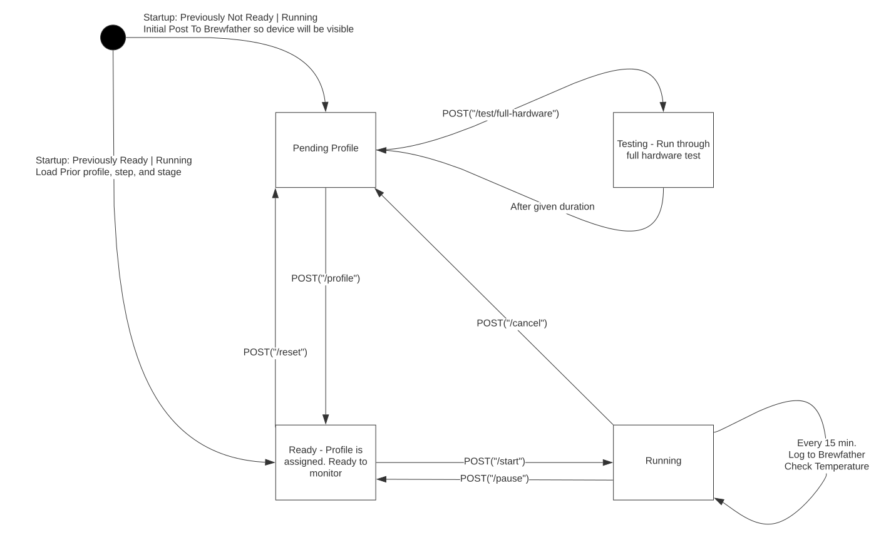

# Fermbot
## The Raspberry Pi -based fermentation controller

This project is still under active development and is not stable

Version: 0.1

This project is licenced under the GPL v3. See the license for details. This project may freely be used by any commercial
brewery. However, any modifications to the software must be licensed and released under the GPL v3

##Structure
The Fermbot is broken down into two modules:
1. The monitor collects fermentation statistics and uploads them to brewfather. It takes a snapshot of the fermentation
   every 15 minutes.
2. The controller is responsible for activating the heating and cooling relays to control fermentation

##Setup and Installation
1. Install docker
2. Get the image on your Pi (pull from repo) or build yourself via `docker build .`
3. Start the container via:
```
docker run -p 8080:8080 <image id>
```
4. Run the hardware test to ensure things are working properly `./full-hardware-test.sh`


##Hardware Requirements
Below is how to assemble the hardware. See the [BOM](BOM.md) document for the required hardware

by default 1-wire protocol is to be enabled on GPIO4

... in progress ...

##Configuration
The base configuration file is in `src/main/resources/application-sample.yml` copy this file to `src/main/resources/application.yml` and update it to suit your particular configuration. For example:
- Change the device name in fermbot.suffix to match whatever you'd like to call the device (Note: Device names must be unique to log to brewfather with multiple devices)
- Add the patch to the pytilt script that is in the `python` directory of this repository
- If you are going to use Brewfather. add the ID of your custom stream
- Set cooler.enabled to true if you have cooling.
- If cooling is enabled specify the pin name. The pin names are the names given in the Pi4j library and are specific to your exact model of raspberry pi. See pi4j.com for more information. (Example format of a valid value would be "GPIO 5")
- Do the same for heating
- Set the upper and lower bounds for your desired Hysteresis profile. Smaller values will keep tighter temperature control but will use the heaters and coolers more and will use more energy.
- Set whether or not you have a tilt enabled

##Testing the Configuration
Send a POST request to "/test/full-hardware" to cycle through the heating/cooling modes you have configured above. Submit a JSON payload in the following format to set the duration of each cycle in the test.
```json
{
    "stepDuration": "PT20S"
}
```

That will cycle through each heating mode (heating/cooling/off) for 20 seconds, for three times (i.e. heating on for 20 seconds, cooling on for 20 seconds, then off for 20 seconds).

## Terminology
*State* - The current state of the fermbot machine (see Typical Workflow below)
*Stage* - The current
*Setpoint*
*Profile* 
*Heating Mode*
*Heating Cooling Configuration*

##Typical Workflow:
The Fermbot workflow can be visualized as a state machine with four states:
1. Pending Profile - The Fermbot server is up and is ready to be configured with a fermentation profile
2. Ready - The profile has been configured and the Fermbot is ready to control a fermentation with the given profile
3. Running - The Fermbot is actively montoring (and controlling) a fermentation
4. Testing - The fermbot is running through a cycle of hardware testing.

Below is a state diagram that illustrates the operation of the Fermbot


### Upon Startup
The Fermbot will detect whether or not there is an active fermentation already running before it was previously powered off

## API
Below describes the API of the webserver portion of Fermbot. The front-end client of this API is in the `../webclient` directory.

Right now the Fermbot only supports a single batch at a time. That may be changed in the future.

### API Overview
1. GET /state
2. POST /profile
3. GET /profile
4. POST /start
5. POST /pause
6. POST /cancel
7. POST /reset
8. POST /test/full-hardware
9. GET /snapshots
10. GET /status
11. POST /nextSetpoint


###Configuration of the current Fermentation Profile
Here is an example of how to configure the following fermentation profile (here is a lager)

|Temperature |Duration        |Stage Description   |Include Ramp In Stage |
|------------|----------------|--------------------|----------------------|
|48F         |Until SG=1.023  |Primary Fermentation|N/A                   |
|62F         |For 2 days      |Diacetyl Rest       |false                 |
|34F         |For 14 days     |Cold Crash          |true                  |

*Note: Including the ramp for a specific-gravity based setpoint is nonsensical, there is no 'ramp' to a gravity. Thus, the "includeRamp" property is not applicable
setting the ramp to 'false' for the 62F stage means that the beer will be held for two days at 62F, regardless of the amount of time it takes for the beer to reach that temperature.
The setting of the ramp to 'true' for the 34F means that the 14day clock will start ticking as soon as this stage starts, so if it takes the beer 2 days to go from 62F to 34F, then
the beer will be held at 34F for 12 days (14 days in the setpoint minus the two days it takes to reach the setpoint)*

```json
[
 {
	"tempSetpoint": "48F",
	"untilSg": 1.023,
	"stageDescription": "Primary"
 },
 {
	"tempSetpoint": "62F",
	"duration": "P2D", 
	"stageDescription": "Diacetyl Rest",
	"includeRamp": false 
 },
 {
	"tempSetpoint": "34F",
	"duration": "P14D",
	"stageDescription": "Cold Crash",
	"includeRamp": true
 }
]
```
**Note** Durations are in [ISO-8601 format]("https://www.digi.com/resources/documentation/digidocs/90001437-13/reference/r_iso_8601_duration_format.htm")

The fermentation profile can be retrieved or changed via a GET or POST request to the "/profile" URL.

The JSON payload of the current stage can be retrieved by issuing a GET request to the "/profile/currentStage" URL

Each time the profile is updated, it is persisted to disk and will be retrieved upon next startup. The profile is serialized to JSON and written under 
`./.fermbot/current-profile.json` and the current stage (integer index of the stage within the profile) is written under
`./.fermbot/current-profile-stage`

For easy reporting via Excel/Google Sheets. The current fermentation snapshots will be written to `.fermentation-snapshots` and can be easily plotted and manipulated via a spreadsheet
